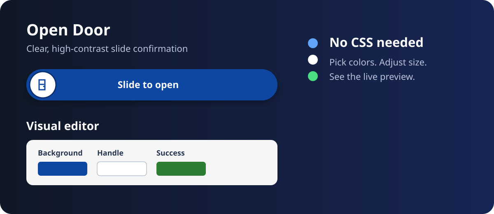

# Slide Confirm Plus

A Home Assistant custom card for actions that should not happen from one accidental tap. Drag the high-contrast handle all the way across to call a service.

Slide Confirm Plus adds a visual dashboard editor and practical appearance controls to the original Slide to Confirm card: color pickers for the track, handle, text, and success state; plus height, handle size, and corner-radius inputs. Changes are reflected in Home Assistant's live card preview while editing.



## Why this fork

The original card is intentionally simple and dependable. This fork keeps the same slide-to-confirm interaction while making it easier to match a dashboard without CSS or card-mod. The default handle is larger, white, outlined, and set against a strong blue track so it is easy to see at a glance.

## Install

### HACS

1. In HACS, open **Frontend** and select **Custom repositories**.
2. Add this repository with category **Dashboard**.
3. Install **Slide Confirm Plus** and reload Home Assistant.
4. Add the card to a dashboard. The visual editor is available when you choose the card in the dashboard UI.

### Manual

Copy `dist/slide-confirm.js` to `/config/www/slide-confirm-plus.js`, then add it as a Lovelace JavaScript module resource:

```yaml
url: /local/slide-confirm-plus.js
type: module
```

## Visual editor

The editor supports one primary slider and offers normal inputs instead of a CSS configuration surface:

- card and slider title
- service and target entity
- instruction and completion text
- icon names
- background, handle, text, success-background, and success-handle color pickers
- slider height, handle size, and corner radius

For multiple sliders, use the dashboard's YAML editor. The editor preserves additional sliders while editing the first one.

## Example

```yaml
type: custom:slide-confirm-card
header: Front entrance
sliders:
  - name: Open Door
    icon: mdi:door
    textUnconfirmed: Slide to open
    textConfirmed: Door command sent
    iconUnconfirmed: mdi:door-closed
    iconConfirmed: mdi:door-open
    confirmation_duration: 1800
    appearance:
      background_color: '#0d47a1'
      handle_color: '#ffffff'
      text_color: '#ffffff'
      confirmed_background_color: '#2e7d32'
      confirmed_handle_color: '#ffffff'
      height: 64
      handle_size: 54
      border_radius: 32
    confirm_action:
      action: call-service
      service: switch.toggle
      target:
        entity_id: switch.entree_haustur_299
```

## Configuration

Each slider retains the original action fields:

| Field | Required | Description |
| --- | --- | --- |
| `name` | no | Text above the slider. |
| `icon` | no | MDI icon beside the title. |
| `textUnconfirmed` | no | Text shown before confirming. |
| `textConfirmed` | no | Text shown after confirming. |
| `iconUnconfirmed` | no | MDI icon inside the handle before confirming. |
| `iconConfirmed` | no | MDI icon inside the handle after confirming. |
| `confirmation_duration` | no | Success display time in milliseconds; 500–10,000, default 1,500. |
| `confirm_action` | yes | A Home Assistant `call-service` action. |
| `appearance` | no | Appearance options below. |

### `appearance`

All color values are hex colors. The visual editor writes these values for you.

| Field | Default | Description |
| --- | --- | --- |
| `background_color` | `#1976d2` | Normal slider-track color. |
| `handle_color` | `#ffffff` | Normal handle color. |
| `text_color` | `#ffffff` | Instruction and completion text color. |
| `confirmed_background_color` | `#2e7d32` | Track color after a successful slide. |
| `confirmed_handle_color` | `#ffffff` | Handle color after a successful slide. |
| `height` | `56` | Slider height in pixels; 40–120. |
| `handle_size` | `48` | Handle diameter in pixels; 32–100. It is kept inside the slider height. |
| `border_radius` | half the height | Corner radius in pixels; 0–60. |

## Safety and behavior

- A service is called only after the handle reaches the end of the track.
- Pointer events are used for mouse and touch, avoiding duplicate touch/pointer handling.
- The confirmation threshold has a small tolerance, so a successful full slide is reliable.
- This card does not determine whether an action is safe. For locks, doors, or other physical controls, enforce authorization and safety checks in Home Assistant too.

## Credits and license

Slide Confirm Plus is a derivative of [Slide to Confirm](https://github.com/itsbrianburton/slide-confirm) by Brian Burton. The original project supplied the card concept, structure, and slide-confirm interaction. This repository adds the visual editor, appearance model, accessibility labels, stronger default contrast, and input handling improvements.

The upstream project is licensed under the MIT License. Its copyright notice is retained in [LICENSE](LICENSE), as required by that license.

## Development

```bash
npm install
HOME=/root npm run build
```

`HOME=/root` is only needed in restricted container environments where SWC cannot use the shared home cache. Normal local environments can use `npm run build`.
